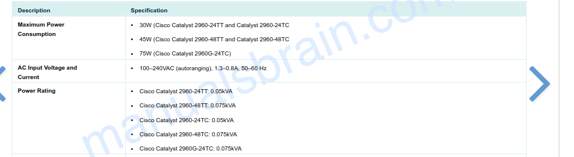
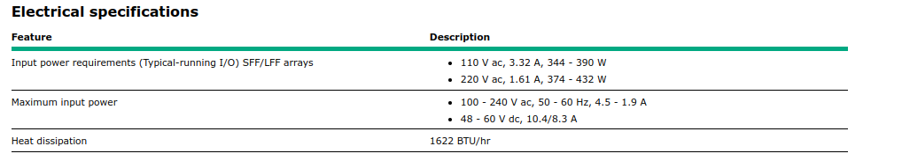

# MDPS
### HP Proliant DL120 G7
- from MDPS manuals/datasheets
- 

### Cisco Catalyst 3750x Switch
- from MDPS manuals/datasheets
- 

# BB-B / BB-A
### Cisco Catalyst 3750G-24TS
- from ATMS Hardware Specs book 7
- 

### Cisco Catalyst WS-C2960-24TC-L
- https://manualsbrain.com/en/manuals/121354/?page=11
- 

### Meinberg LAN Time M300
- https://www.manualslib.com/manual/1730713/Meinberg-Lantime-M300-Gps-2lne-Rps.html#manual
- 

### CISCO 2821
- https://www.cisco.com/c/dam/global/de_at/assets/unified_partners/smb/vertriebliche-positionierung/routing/downloads/isr_2800_datenblatt_e.pdf
- 

###  HP Proliant DL380 G7
- from ATMS manual book 7
- 

# AMHS2
### HP Proliant DL380P Gen 8
- https://microage.com/wp-content/uploads/2016/02/HP-ProLiant-DL380p-Gen8-Server-data-sheet.pdf
- 

### Cisco Catalyst 3560v2 ( CISCO 3560V2-48TS)
- model from AMHS hardware course
- https://objects.eanixter.com/PD328004.PDF
- 

### Cisco 1921 ISR
- https://www.cisco.com/c/dam/global/en_ph/solutions/smb/velocity/Downloads/data_sheet_1921router.pdf
- 
### Cisco C2960 Plus Series SI (CISCO 2960-24TC-S)
- https://manualsbrain.com/en/manuals/54730/?page=9
- 

### Cisco 1760
- https://www.andovercg.com/datasheets/cisco-1760-router.pdf
- 

### ATEN KVM Switch KH1508A
- https://www.aten.com/global/en/products/kvm/cat-5-kvm-switches/kh1508a/
- 

### ATEN CL1000M TFT Display
- https://www.aten.com/global/en/products/kvm/lcd-kvm-switches--consoles/cl1000/
- 

# AMHS1
### NetPerformer SDM8400
- http://www.satcomsource.com/Comtech-EF-Data-Memotec-NetPerformer-SDM-8400-IP-Satellite-Routers.pdf
- 

### Cisco C2960 Plus Series SI (CISCO 2960-24TC-S)
- https://manualsbrain.com/en/manuals/54730/?page=9
- 

### PAGASA LINK ROUTER TP-Link TL-SG3210
- https://www.tp-link.com/us/business-networking/managed-switch/tl-sg3210/#specifications
 - 

### CRV Router Cisco WS-2960-24TT-L
- https://manualsbrain.com/en/manuals/25934/?page=11
- 

# SPS
### HP TFT7600 G2 
- SPS manual book3
- 

### KVM Switch AF616A
- SPS manual book3
- 

### Cisco Catalyst WS-C2960G-48TC-L
- https://www.cisco.com/c/dam/en_us/solutions/small-business/products/routers-switches/catalyst-2960-series-switches/C78-481303-01_2960-LAN_DS_v1a.pdf
- 

### HP Proliant DL380P Gen 8
- https://microage.com/wp-content/uploads/2016/02/HP-ProLiant-DL380p-Gen8-Server-data-sheet.pdf
- 

### HP Proliant DL360P Gen8
- SPS manual book3
- 

### HP Z400 Workstation
- https://support.hp.com/ph-en/document/c01709672
- 

### Cisco Catalyst WS-C2960-24TC-L
- https://manualsbrain.com/en/manuals/121354/?page=11
- 

# AISS
### Cisco Catalyst WS-C2960G-48TC-L
- https://www.cisco.com/c/dam/en_us/solutions/small-business/products/routers-switches/catalyst-2960-series-switches/C78-481303-01_2960-LAN_DS_v1a.pdf
- 

### HP 8-8 SAN Switch
- AISS Manuals Book 4
- 

### Cisco ASA 5512X
- AISS Manuals Book4
- 

### HP TFT7600 G2 
- AISS manualS book4
- 

### KVM Switch AF616A
- AISS manuals Book4
- 

### HP Storageworks MSL2024
- AISS manuals Book4
- 

### HP MSA2040 San Storage
- https://support.hpe.com/hpesc/public/docDisplay?docId=emr_na-c03819840
- 

### HP Proliant DL380P Gen 8
- https://microage.com/wp-content/uploads/2016/02/HP-ProLiant-DL380p-Gen8-Server-data-sheet.pdf
- 