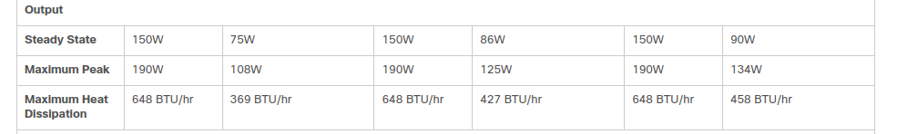

# WEB02
### Cisco Catalyst WS-C2960-24TC-L
- https://manualsbrain.com/en/manuals/121354/?page=11
- 

### Cisco ASA 5525x
- https://www.cisco.com/c/en/us/products/collateral/security/asa-5500-series-next-generation-firewalls/data_sheet_c78-701808.html
- 

### Cisco Catalyst WS-C3750G-48TS-S
- https://www.cisco.com/c/en/us/products/collateral/switches/catalyst-3750-series-switches/product_data_sheet0900aecd80371991.html
- 

### HP TFT7600 G2 
- AISS manualS book4
- 

### KVM Switch AF616A
- AISS manuals Book4
- 

### HP Proliant DL360P Gen 8
- https://support.hpe.com/hpesc/public/docDisplay?docId=emr_na-c03243992
- 

### HP Proliant DL380P Gen 8
- https://microage.com/wp-content/uploads/2016/02/HP-ProLiant-DL380p-Gen8-Server-data-sheet.pdf
- 

# WEB01
### Cisco Catalyst WS-C2960-24TC-L
- https://manualsbrain.com/en/manuals/121354/?page=11
- 

### Cisco ASA 5525x
- https://www.cisco.com/c/en/us/products/collateral/security/asa-5500-series-next-generation-firewalls/data_sheet_c78-701808.html
- 

### HP Proliant DL360P Gen 8
- https://support.hpe.com/hpesc/public/docDisplay?docId=emr_na-c03243992
- 

### HP Proliant DL380p Gen7
- https://support.hpe.com/hpesc/public/docDisplay?docId=emr_na-c02215298
- 

# JPDP4

### Cisco WS-2960-24TT-L
- https://manualsbrain.com/en/manuals/25934/?page=11
- 

### KVM Console IUM-108D
- http://www.dynamix.co.nz/content/images/PDF/iumx.pdf
- 

### HP Proliant DL360P Gen 7
- http://www.hp.com/hpinfo/newsroom/press_kits/2010/breakingthegridlock2010/DL360G7ServerDS.pdf
- 

### Deutronics D-TOP120 - 12V 8A output
- https://www.rgbautomatyka.pl/en/p/file/0a3438bad5fe127b2719b8408712ef05/DPM120-POWER-SUPPLYU-DEUTRONIC-D-TOP-MANUAL.pdf
- 

# VCS3
### BGT-PS02
- From VCS Manuals Book 6
- 

### ECPU 02 AC Variant-04
- From VCS Manuals Book 6
- 