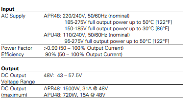
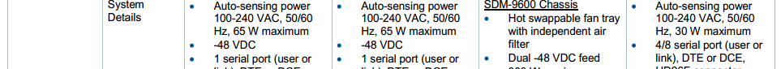
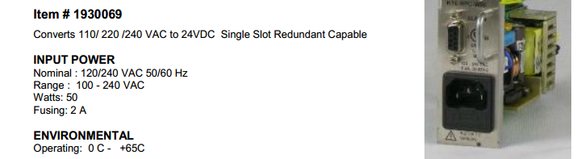
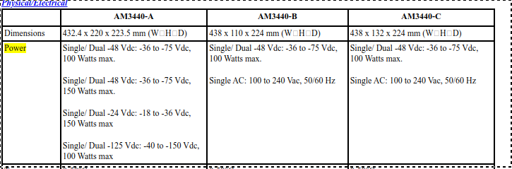
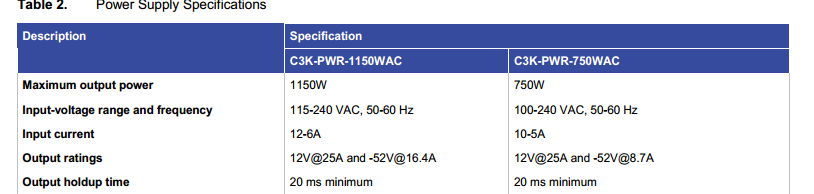
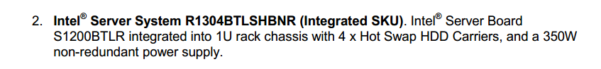
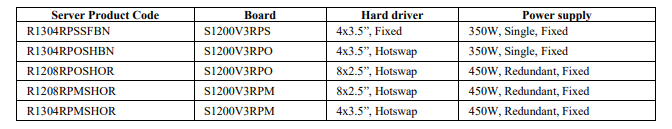
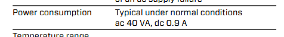

# MCL01
### Eaton APR48
- Supply for RML3,RML4,RML7
- https://www.eaton.com/content/dam/eaton/products/backup-power-ups-surge-it-power-distribution/backup-power-ups/avaya-solutions/avaya-apr48-apu48-rectifier-product-information.pdf
- 

### NetPerformer SDM-9220
- MUX Manuals Book4
- 

# MUX01
### Skyedge II VSAT Modem
- from VSAT Manuals book 5
- 

### V3G1 NetPerformer SDM-9230
- MUX Manuals Book4
- 

### RSS Switch
- MUX Manuals Book4
- 

### Loop-AM3440A Access DCS-MUX
- MUX Manuals Book4
- 

### Cisco RPS 2300
- MUX Manuals Book4
- 

### Intel Corporation SERVER SYSTEM LC BOARD (R1304BTLSFANR)
- MUX Manuals Book4
- 

# VSAT
### MCR Multi Channel Receiver 563000
- VSAT Manuals Book 5
- 

### L-Band RF-Switch 549132
- VSAT Manuals Book 5
- 

### IPE Modulator (IPM) DVB-S2 590000
- VSAT Manuals Book 5
- 

### L-Band Redundant Line Amplifier 579132
- VSAT Manuals Book 5
- 

### LowFly
- VSAT Manuals Book 5
- 

### Remote Spectrum Analyzer RSA2300B
- VSAT Manuals Book 5
- 

### Raritan KVM Switch CAT216
- https://www.kvm-switches-online.com/mccat216.html
- 
- https://www.digi.com/products/networking/infrastructure-management/serial-connectivity/terminal-servers/connectport-ts-8-16#specifications
- 

### QOS NetEnforcer AC502
- VSAT Manuals Book 5
- 

### SkyMon ,QOS NMS Intel Server System SR1630GP
- VSAT Manuals Book 5
- 

### NMS Server Intel Server System SR1695WB
- https://www.intel.com/content/dam/support/us/en/documents/motherboards/server/s5500wb/sb/sr1695wb_tps_r1_4.pdf
- 

### QOS NMS, HSP Intel Server System R1000RP
- https://www.intel.com/content/dam/support/us/en/documents/motherboards/server/sb/g87275003_r1000rp_sg_r2_0.pdf
- 

# VHF3, VHF2, VHF1
### ParkAir T6R Receiver
- VHF Manuals Book 4
- 

### TPLink TL-SF1016
- https://www.tp-link.com/us/business-networking/unmanaged-switch/tl-sf1016/#specifications
- 

### Cisco Small Business SR224
- http://www.telecomdatasheets.com/ddata/359.pdf
- 