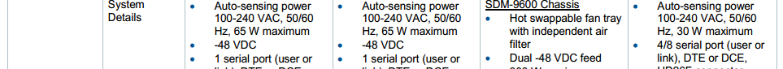
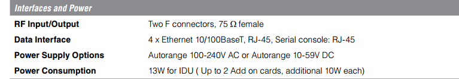
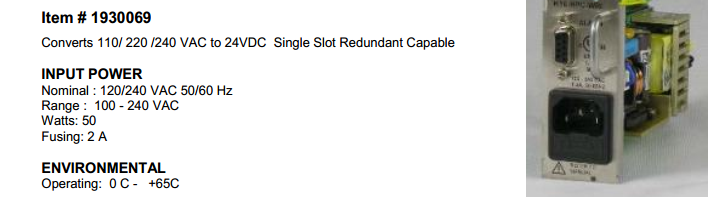
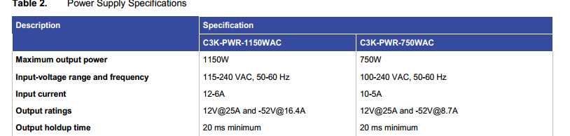
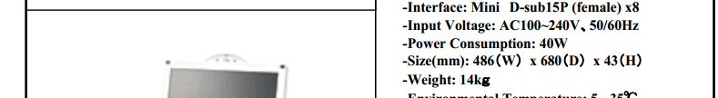

# MCL02
### Loop Telecom AM3440CHCJ-G
- MUX Manuals Book4
- 

### NetPerformer SDM-9230
- MUX Manuals Book4
- 

### pLines pLinesES4-8
- https://www.acoutronic.se/pdf/embedded_systems/IC_DS_pLinesE48.pdf
- 

### Cisco Catalyst WS-C3560-24TS-S
- https://www.andovercg.com/datasheets/cisco-3560-catalyst-datasheet.pdf
- 

# MUX02
### Skyedge II VSAT Modem
- from VSAT Manuals book 5
- 

### V3G1 NetPerformer SDM-9230
- MUX Manuals Book4
- 

### RSS Switch
- MUX Manuals Book4
- 

### Loop-AM3440A Access DCS-MUX
- MUX Manuals Book4
- 

### Cisco RPS 2300
- MUX Manuals Book4
- 

# VSAT02
### MCR Multi Channel Receiver 563000
- VSAT Manuals Book 5
- 

### L-Band RF-Switch 549132
- VSAT Manuals Book 5
- 

### IPE Modulator (IPM) DVB-S2 590000
- VSAT Manuals Book 5
- 

### L-Band Redundant Line Amplifier 579132
- VSAT Manuals Book 5
- 

### LowFly
- VSAT Manuals Book 5
- 

### Remote Spectrum Analyzer RSA2300B
- VSAT Manuals Book 5
- 

### Raritan KVM Switch CAT216
- https://www.kvm-switches-online.com/mccat216.html
- 
- https://www.digi.com/products/networking/infrastructure-management/serial-connectivity/terminal-servers/connectport-ts-8-16#specifications
- 

### QOS NetEnforcer AC502
- VSAT Manuals Book 5
- 

### SkyMon Intel Server System SR1630GP
- VSAT Manuals Book 5
- 

### NMS Server Intel Server System SR1695WB
- https://www.intel.com/content/dam/support/us/en/documents/motherboards/server/s5500wb/sb/sr1695wb_tps_r1_4.pdf
- 

### QOS NMS, HSP Intel Server System R1000RP
- https://www.intel.com/content/dam/support/us/en/documents/motherboards/server/sb/g87275003_r1000rp_sg_r2_0.pdf
- 

# ADSB
### Transmitter Module AX680
- ADSB References Book 1
- 

### Cisco SG300-20 Managed Switch
- https://www.voipsupply.com/downloads/dl/file/id/150/cisco_300_series_switches_datasheet.pdf
- 

# GSMS
### RAIM-DA-001-NEC N8100-1725F
- from GSMS Manuals Book 1_ Functional Baseline
- 

### RAIM-CS-001 N8100-1725F
- from GSMS Manuals Book 1_ Functional Baseline
- 

### External Removable Disk Imation RDX-USB-EXT-DOCK
- from GSMS Manuals Book 1_ Functional Baseline
- 

### Cisco Catalyst WS-2960G-24TC-L
- from GSMS Manuals Book 1_ Functional Baseline
- 

### Firewall CPAP-SG578
- from GSMS Manuals Book 1_ Functional Baseline
- 

### Console Unit N8143-69F
- from GSMS Manuals Book 1_ Functional Baseline
- 

# MISC
### Cisco Catalyst WS-2960G-24TC-L
- from GSMS Manuals Book 1_ Functional Baseline
- 

### L-Band Satellite Modem CDM-570A/L-IPEN Satellite Modem
- http://www.comtechefdata.com/files/datasheets/ds-cdm570A-L-IPEN.pdf
- 
